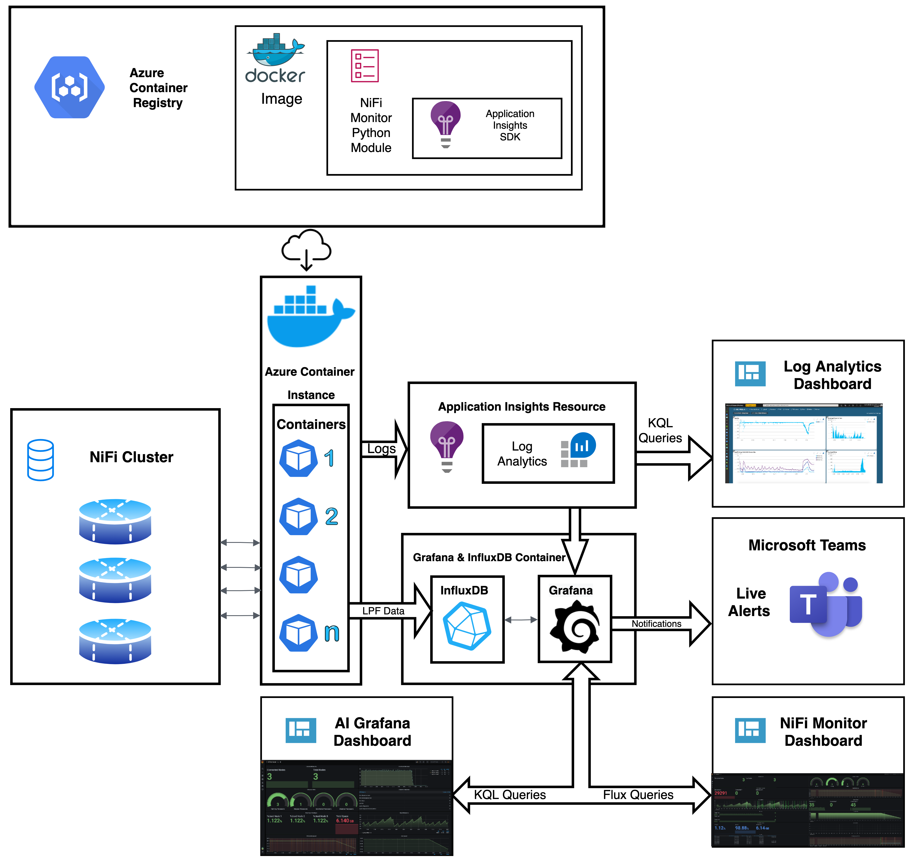

# MonitoFi : Health & Performance Monitor for Apache NiFi

  One Place for monitoring Health and Performance of your Apache NiFi Cluster!

## Features :

* Runs as an external program to Apache NiFi cluster and can be deployed anywhere as long as it is able to access the Apache NiFi Cluster
* Monitors the health and performance of the cluster
* Backed by Data polled using Apache NiFi-API
* Support for SECURE clusters via PKCS12 Cert Based Login
* Ability to Send Notifications/Alerts Based on Anomalies in Flows or Cluster Operation
* Highly Configurable
* Comes with Ready To Import Grafana Dashboards, Notification Channels
* Easy Optional Integration with Azure Application Insights
  
  There are 2 configurations in which this application can be deployed. 

  1. Store Monitoring Data locally using InfluxDB and Display charts via Grafana.
  2. Store Data in Azure Application Insights Resource & locally in InfluxDB and Display charts via Grafana.

  Both Options Support Sending Timely Alerts/Notifications to Microsoft Teams or Email via Grafana whenever anomalies in cluster or execution of flow are detected.
  
  ### On Prem :
  MonitoFi uses InfluxDB for storing the monitoring data locally and uses Grafana to plot various charts & queries in Dashboards & Send Timely Alerts incase anomalies in cluster or execution of flow are detected. These queries can be easily configured based on your needs.

  ### Azure Application Insights: 
  Using a Simple Instrumentation Key Received when creating an Application Insights Resource in Azure, all the MonitoFi monitoring data can be pushed to Azure. This data can be viewed using Grafana by importing included AIDashboard. Queries for data in Application Insights are written using Kusto Query Language and are easy to modify.

  Visit https://github.com/tushardhadiwal/docker-influxdb-grafana for Grafana And InfludDB Support.\
  Visit https://github.com/microsoft/MonitoFi for MonitoFi Source Code.

## Architecture



#### Quick Start

Run following commands on machine which has access to Apache NiFi cluster:
```sh
git clone git@github.com:microsoft/MonitoFi.git
```
Fully Automated Script will take care of running InfluxDB & Grafana container , configuring datasources in grafana, importing pre included dashboards in grafana, Adding notification channels if needed, Running MonitoFi container against your cluster. Please set variables at the top of the script to desired state.
```sh
./deploy.sh
```

You can now visit http://localhost:3003 to access Grafana with following credentials.
```sh
Username: root
Password: root
```

#### DIY Deployment:

To run MonitoFi along with InfluxDb & Grafana:

Run this container for getting a preconfigured InfluxDB and Grafana Instance that MonitoFi can push data to.

```sh
docker run -d \
  --name influxdb-grafana \
  --network=host \
  -p 3003:3003 \
  -p 3004:8083 \
  -p 8086:8086 \
  -v /home/$(whoami)/monitofi/influx:/var/lib/influxdb \
  -v /home/$(whoami)/monitofi/grafana:/var/lib/grafana \
  dtushar/docker-influxdb-grafana:latest
```
You can now visit http://localhost:3003 to access Grafana with following credentials.
```sh
Username: root
Password: root
```

- Add datasources for InfluxDB,InfluxDB-Flux & Azure Monitor. 
- Import Dashboards available in this repository to Grafana. 
- You can modify the queries to adjust to number of nodes in your Apache NiFi cluster.
- Configure alerts/notifications as Needed. Microsoft Teams alerts template can be imported as shown in deploy script.

Pleae Refer to deploy.sh script for adding various datasources and configurations related to grafana with curl commands.

Run this command to run MonitoFi against your NiFi Cluster :

```sh
docker run \
--name=monitofi1 \
--network=host -d \
-e INFLUXDB_SERVER="influxdb-grafana" \
-e ENDPOINT_LIST="controller/cluster,flow/cluster/summary,flow/process-groups/root,flow/status,counters,system-diagnostics" \
-e SLEEP_INTERVAL=300 \
-e API_URL='http://localhost:8080/nifi-api/' \
--restart unless-stopped \
dtushar/monitofi:1.0
```

If your NiFi Cluster is SECURE and supports login via certificate then please add the following to the above command, this will mount the certificate into MonitoFi Container:
```sh
-e SECURE=True \
-v $(pwd)/keystore.pkcs12:/opt/monitofi/cert.pkcs12 \
-e CERT_PASS="PasswordForCertificate" \
```

* To run MonitoFi along with InfluxDb & Grafana & Push Monitoring Data to Application Insights, Please create a Application Insights Resource, and provide the Instrumentation Key while running the container.  
* An Azure Log Analytics Dashboard can be created using similar KQL Queries and Using Grafana can be skipped if desired. Add the following lines to above command:

```sh
-e IKEY="Optional AppInsights Instrumentation Key" \ 
--add-host <Public URL_Of_NiFi_Cluster>:<Public_IP_of_Cluster> \
```

## Contributing

This project welcomes contributions and suggestions.  Most contributions require you to agree to a
Contributor License Agreement (CLA) declaring that you have the right to, and actually do, grant us
the rights to use your contribution. For details, visit https://cla.opensource.microsoft.com.

When you submit a pull request, a CLA bot will automatically determine whether you need to provide
a CLA and decorate the PR appropriately (e.g., status check, comment). Simply follow the instructions
provided by the bot. You will only need to do this once across all repos using our CLA.

This project has adopted the [Microsoft Open Source Code of Conduct](https://opensource.microsoft.com/codeofconduct/).
For more information see the [Code of Conduct FAQ](https://opensource.microsoft.com/codeofconduct/faq/) or
contact [opencode@microsoft.com](mailto:opencode@microsoft.com) with any additional questions or comments.

## Trademarks

This project may contain trademarks or logos for projects, products, or services. Authorized use of Microsoft 
trademarks or logos is subject to and must follow 
[Microsoft's Trademark & Brand Guidelines](https://www.microsoft.com/en-us/legal/intellectualproperty/trademarks/usage/general).
Use of Microsoft trademarks or logos in modified versions of this project must not cause confusion or imply Microsoft sponsorship.
Any use of third-party trademarks or logos are subject to those third-party's policies.
